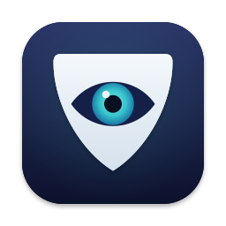

<p align="center">
  
</p>

<h1 align="center">Sentinel</h1>

<p align="center"><em>The little eye in your menu bar that locks your Mac when you wander off.</em></p>

Your Mac has a camera. You have a face. Sentinel introduces them — one frame every 30 seconds, just long enough to confirm somebody's still in the chair.

- **While you're there** (anyone in view counts — you don't have to be looking at the camera), Sentinel holds the display awake. No more screen-dimming mid-paragraph because you dared to read something for four whole minutes.
- **When you wander off** — coffee, snack, an unusually long chat by the watercooler — it notices the empty chair, waits out a polite grace period (30 seconds by default), and locks the screen behind you. (Rather it never locked? Set **Lock After Absence → Never** and Sentinel only manages the keep-awake part.)
- **It's not creepy about it.** One single frame per check, the camera light blinks briefly to prove it, and the frame is analyzed on-device with Apple's Vision framework. Nothing is stored, nothing leaves your Mac, and Sentinel never learns *whose* face it saw — only that someone's home.

## Install

### From a GitHub release

Download the latest `Sentinel-X.Y.Z.dmg` from the repo's **Releases** page, open it, and drag **Sentinel** into **Applications**. Releases are Developer ID signed and notarized, so Gatekeeper opens them without complaint and the camera permission you grant survives upgrades.

> **Upgrading from an older, ad-hoc-signed release?** The signature identity changed once, so macOS asks for camera permission one more time. If checks report a camera problem without prompting, run `tccutil reset Camera com.github.martintreurnicht.sentinel` and relaunch.

## Updates

Sentinel updates itself via [Sparkle](https://sparkle-project.org): it checks the repo's releases once a day, downloads new versions silently in the background, and installs them the next time the app quits, relaunches, or the Mac restarts. No dialogs — when an update is staged, the menu shows **Update Ready — Install Now…** if you'd rather apply it immediately, and **Check for Updates…** is always available.

Prefer to drive yourself? Untick **Update Automatically** in the menu (on by default) and Sentinel won't check or download anything on its own — **Check for Updates…** still works manually, and the choice persists across restarts.

Updates are verified twice over: against an EdDSA signature baked into the app (`SUPublicEDKey`) and against the Developer ID code signature. Installs predating automatic updates (≤ v1.0.1) need one final manual download.

Because every release is signed with the same Developer ID, the camera permission survives updates — no re-prompt after an update applies.

### From source

```sh
make install          # builds, copies to /Applications, launches
```

On first check, macOS asks for camera permission — click **Allow**. Then open the menu bar icon and enable **Launch at Login**.

For development, `make run` builds and launches straight from `build/Sentinel.app`.

> **Tip — code signing:** the default build is ad-hoc signed, so macOS treats every rebuild as a new app and re-asks for camera permission. If you have an Apple Development certificate, build with `make CODESIGN_IDENTITY="Apple Development"` and the permission grant survives rebuilds.

## How it works

| You | Sentinel |
|---|---|
| Sitting at your Mac | Checks a webcam frame every 30 s, finds you (your face — or, when you're looking away, enough of you in the frame), keeps the display awake (`pmset -g assertions` shows *Sentinel: user present at webcam*) |
| Step away | Next check misses you → 30 s grace → one final check → screen locks. With **Lock After Absence → Never** it stops holding the display awake instead (your normal display-sleep schedule takes over) and keeps watching for your return |
| Come back and unlock | Unlocking is treated as proof of presence; monitoring resumes, no instant camera check |
| Screen locked / Mac asleep | Polling fully suspended — no camera blinks while the screen is locked or the Mac is sleeping. In never-lock mode the screen stays unlocked when you leave, so periodic checks (and the camera blink) continue until macOS itself locks or sleeps; the check that spots your return re-engages keep-awake and can even relight a sleeping display (within one poll interval) |

The lock itself uses the private `SACLockScreenImmediate` API from `login.framework` (the standard approach for non-App-Store utilities), with `pmset displaysleepnow` as a fallback. The fallback only *locks* (rather than just sleeping the display) if *System Settings → Lock Screen → Require password after screen saver begins or display is turned off* is set to **Immediately**.

### Fail-open by design

A presence guard must never lock you out because the camera broke. Any check that can't produce a confident verdict — permission denied, no camera, capture timeout, frame too dark (lens covered, lid closed, lights off) — counts as *inconclusive*, never as *absent*. Sentinel releases its assertions, shows the problem in the menu, and retries on the normal schedule. Only a well-lit, successfully analyzed frame containing no one moves toward locking.

## Menu

- **Check Now** — immediate presence check
- **Pause** — 15 minutes / 1 hour / until resumed (releases assertions, stops camera checks)
- **Check Every** — 10 s / 30 s / 1 min / 2 min / 5 min
- **Lock After Absence** — immediately / 15 s / 30 s / 1 min / 2 min of grace after a missed check, or **Never (don't lock)**: only the keep-awake hold is released when you leave, and checks continue so it re-engages the moment you're back
- **Camera** — Automatic (system preferred) or a specific device
- **Launch at Login** — registers via `SMAppService`
- **Check for Updates…** — manual check (below the current version); becomes **Update Ready — Install Now…** while a downloaded update waits to install
- **Update Automatically** — ticked by default; untick to stop automatic checks and downloads (manual checks still work)

## Configuration from the terminal

All settings live in `UserDefaults` under `com.github.martintreurnicht.sentinel`:

```sh
defaults write com.github.martintreurnicht.sentinel pollInterval -float 30        # seconds between checks (min 5)
defaults write com.github.martintreurnicht.sentinel absenceGracePeriod -float 30  # seconds before lock after a miss (0 = immediate)
defaults write com.github.martintreurnicht.sentinel lockOnAbsence -bool true      # false = never lock; only manage display keep-awake
defaults write com.github.martintreurnicht.sentinel cameraUniqueID -string ""     # "" = automatic
defaults write com.github.martintreurnicht.sentinel warmupFrames -int 8           # frames discarded while auto-exposure settles
defaults write com.github.martintreurnicht.sentinel checkTimeout -float 10        # seconds allowed per capture
defaults write com.github.martintreurnicht.sentinel lockMethod -string auto       # auto | private | pmset
defaults write com.github.martintreurnicht.sentinel detectionMode -string person  # person = face or anyone in frame (default) | face = strict, face only
```

Restart Sentinel (or change any setting from the menu) after editing defaults externally.

## Development

```sh
make            # build release bundle into build/Sentinel.app
make test       # state-machine unit tests
make run        # build + relaunch
make icon       # regenerate build/AppIcon.icns from scripts/generate-icon.swift
make dmg        # build a drag-to-install disk image (build/Sentinel.dmg)
make zip        # build the Sparkle update archive (build/Sentinel.zip)
make verify     # lint Info.plist, check Sparkle embedding, verify code signature and bundled icon
make logs       # follow live logs (subsystem com.github.martintreurnicht.sentinel)
make uninstall  # remove from /Applications
```

With the app running and a face visible, `pmset -g assertions` should list a `PreventUserIdleDisplaySleep` assertion named *Sentinel: user present at webcam*.

## Releases & automatic versioning

CI is set up so that **every merge to `main` ships a release** (`.github/workflows/release.yml`):

1. `scripts/next-version.sh` computes the next version from the latest `vX.Y.Z` git tag and the commits since it:
   - **major** — any commit containing `#major` or `BREAKING CHANGE`, or a conventional `type!:` subject (e.g. `feat!: …`)
   - **minor** — any commit containing `#minor`, or a `feat:` / `feat(scope):` subject
   - **patch** — everything else (the default)
   - no tags yet → `1.0.0`
2. Tests run, then a **universal (arm64 + x86_64) DMG** is built with the version stamped into `CFBundleShortVersionString` and the CI run number into `CFBundleVersion`. The checked-in `Support/Info.plist` keeps its placeholder — versions live in git tags, so no bump commits and no workflow loops.
3. A Sparkle update archive (`Sentinel-X.Y.Z.zip`) is built from the same bundle and `generate_appcast` signs it with the EdDSA key from the `SPARKLE_PRIVATE_KEY` repo secret, producing a single-item `appcast.xml`.
4. The commit is tagged `vX.Y.Z` and a GitHub release is created (draft first, published once all assets are up) with auto-generated notes, the DMG, the zip, and `appcast.xml` attached. Installed apps poll the stable URL `releases/latest/download/appcast.xml`, which always redirects to the newest release's appcast.

Squash-merge PRs and the PR title becomes the commit subject that drives the bump — e.g. title a PR `feat: add away-time stats` to get a minor release. Re-running the workflow on an already-released commit is a no-op (`skip=true`).

Pull requests themselves get a build + test check (`.github/workflows/ci.yml`).

Release builds are Developer ID signed and notarized. CI imports the certificate into an ephemeral keychain, signs the app (and the nested Sparkle components, inside-out) with the hardened runtime and `Support/Sentinel.entitlements`, signs the DMG, then `scripts/notarize.sh` submits it to Apple's notary service and staples the ticket (`make notarize` + `make verify-notarized`). The signature is what lets the camera permission persist across versions — TCC pins the bundle ID + Team ID rather than the per-build hash. The Sparkle zip carries the same notarized app, so updates are covered by the same ticket.

Signing and notarization need six repository secrets: `MACOS_CERTIFICATE_P12` (base64 .p12 with the Developer ID Application certificate + private key), `MACOS_CERTIFICATE_PASSWORD`, `APPLE_TEAM_ID`, and the App Store Connect API key trio `NOTARY_KEY` (base64 .p8), `NOTARY_KEY_ID`, `NOTARY_KEY_ISSUER_ID`.

> **The Sparkle private key matters.** It lives in the repo's `SPARKLE_PRIVATE_KEY` Actions secret, with the original in the maintainer's login Keychain ("Private key for signing Sparkle updates"). Keep a backup — losing it strands every installed copy on a manual reinstall. Regenerate/export with `.build/artifacts/sparkle/Sparkle/bin/generate_keys`.

## Caveats

- **Dark rooms:** Mac webcams have no IR hardware. In real darkness the luminance guard kicks in and Sentinel fails open (no lock, but also no keep-awake). In a *dim* room detection may miss you — lengthen the grace period or pause if that bites.
- **Looking away is fine:** by default (`detectionMode` = `person`) a frame counts as present if it shows a face *or* a person in view (judged by Apple's on-device person-segmentation model — the same kind video calls use for background blur), so watching a second display or leaning chin-on-hand doesn't read as an empty chair. The flip side: something person-shaped in view (a coat over a chair) can occasionally pass for a person and keep the screen unlocked — set `detectionMode` to `face` for strict face-only detection if that bites.
- **Private API:** `SACLockScreenImmediate` is private and could disappear in a future macOS; Sentinel automatically falls back to `pmset displaysleepnow` (see lock note above). It's verified present on macOS 26.5.
- **Multiple cameras:** "Automatic" follows the system-preferred camera, which may be an external one pointing somewhere unhelpful. Pick a specific camera from the menu if checks misfire.
- **Video calls:** macOS allows concurrent camera access, so Sentinel keeps working during calls (and you're present anyway).
- Removing the app? `make uninstall`, then optionally `tccutil reset Camera com.github.martintreurnicht.sentinel`.
